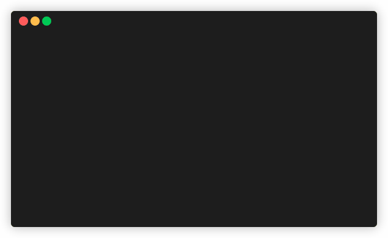

Of course! Here's a basic `README.md` for your `glab-cli` project:

---

# glab-cli

A command-line interface tool to interact with GitLab. There's the official
`glab-cli` tool that allows interaction with almost everything on GitLab via the
command line, but I the only feature that I was using was listing open
merge-requests and then do a checkout to the source branch of the merge-request
I was interested in. So I made a simple script that does both for me, and make
it interactive. 




## Installation

Ensure you have `poetry` installed. If not, you can install it using:

```bash
pip install poetry
```

Then, navigate to the project directory and run:

```bash
poetry install
```

This will install all the necessary dependencies and set up the `glab` command.

## Usage

Run the tool:

```bash
glab
```

## Configuration

Ensure you have the `GITLAB_PERSONAL_ACCESS_TOKEN` environment variable set with your GitLab personal access token. This is required for authentication with the GitLab API.

On unix systems (e.g. Ubuntu, macOS), you can add the line 

```
export GITLAB_PERSONAL_ACCESS_TOKEN="your-token-here"
```

to either `~/.bashrc`, `~/.zshrc` or similar.

## Author

Robert Sokolewicz <rsokolewicz@gmail.com>

## License

MIT license